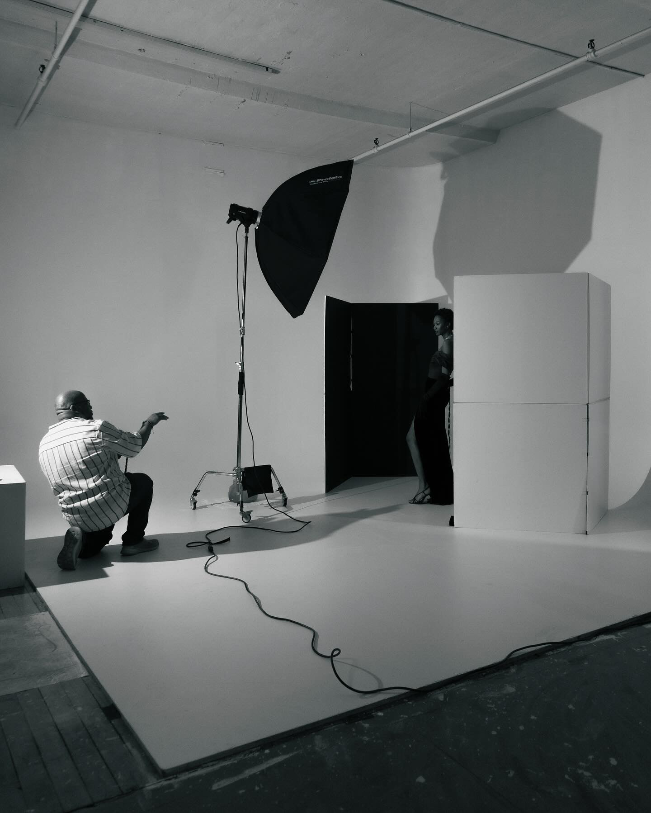

## Introduction

Calvin is an IT professional with 30 plus years of experience in technology from the music recording/engineering, retail, media, and financial industries. In recent years at JPMorgan Chase, Calvin performed as an Analyst in Vendor Management as well invested in supporting client-customer needs. He has come a long way from fixing his neighbors' VCRs and home computers to keeping corporations' platforms evergreen.

Calvin's mantra of "be kind to everyone" has been a driver in building great relationships throughout his career and in life.  Calvin is a New Jersey native, but currently resides in Delaware with his wife. He loves spending quality time with his wife, mother and children.  Calvin is a natural problem solver who loves helping people and experiencing new things.

For most of Calvin's life, he has been known for his passion for the creative arts and technology. Aside from his past music experience, his passion for photography has taken him to newer paths continuing his artistic endeavors. 

## Support

* You can find me on LinkedIn, Facebook, Instagram, and my website at calwaynephotography.com

## Fun Facts

## Photo Gallery

 

