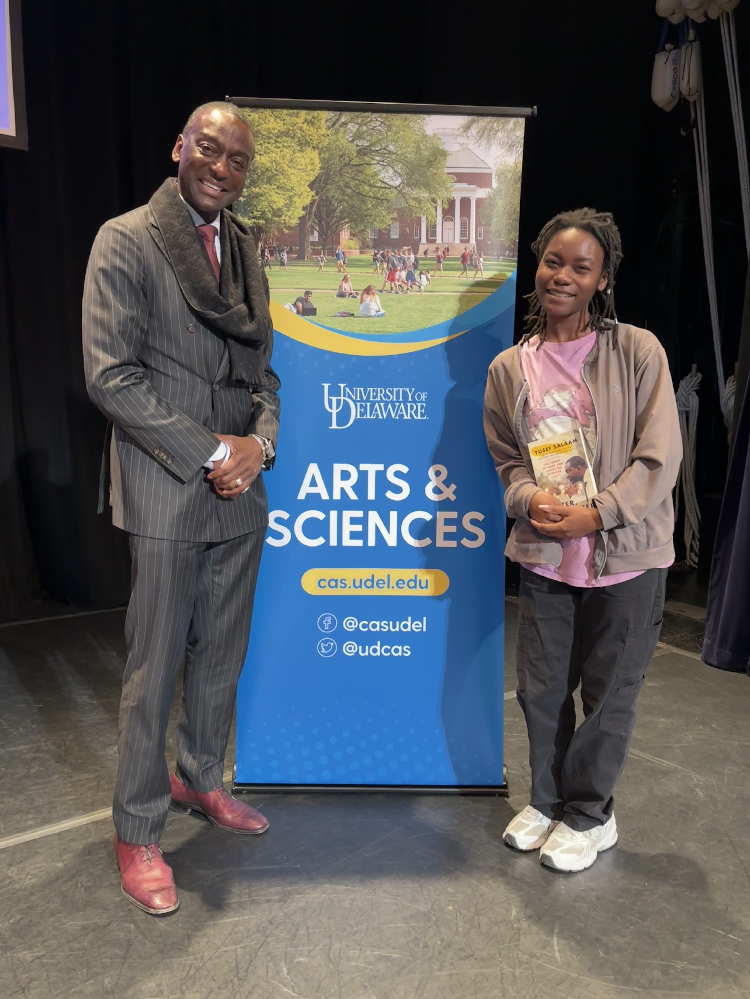
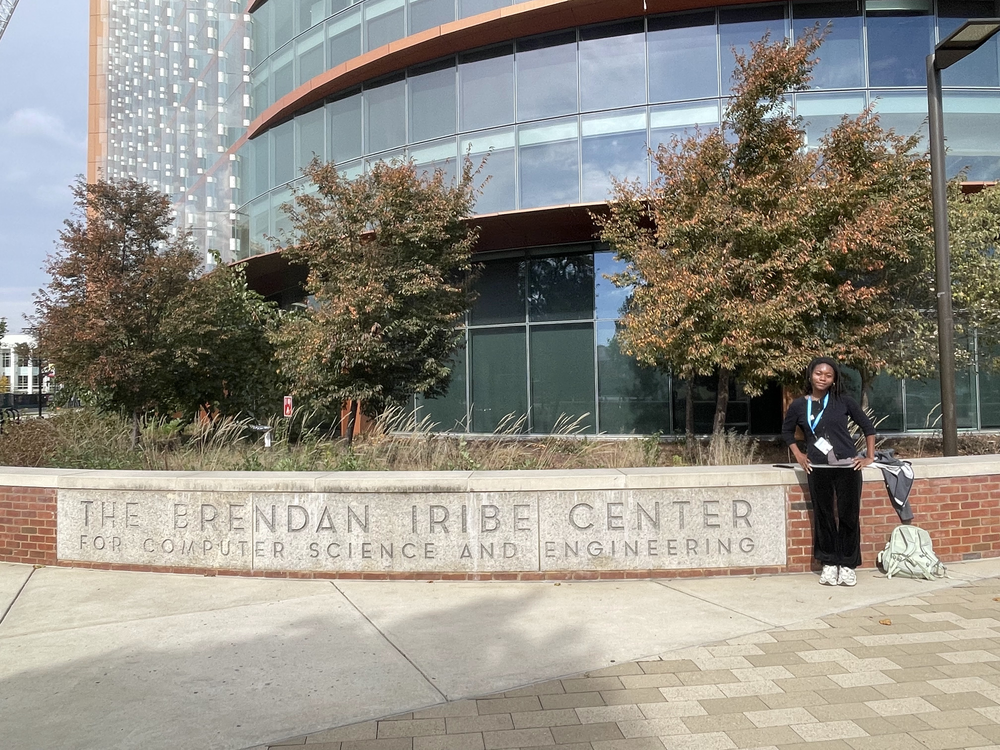
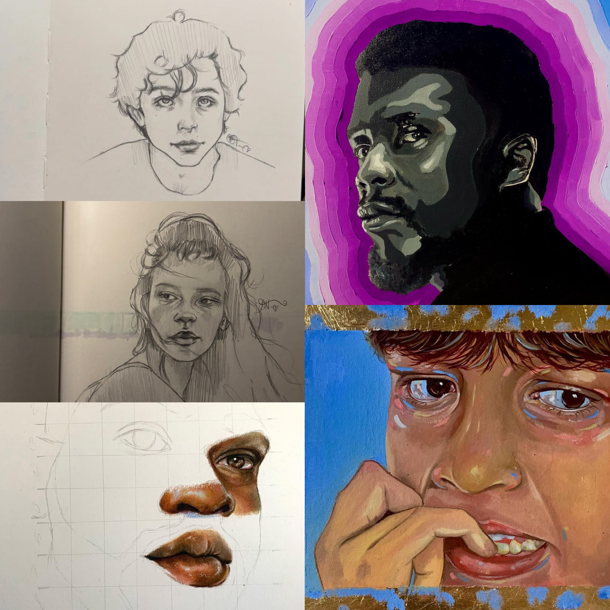

# Brooklyn A. Harden README

## Introduction

Brooklyn is a recent graduate of the University of Delaware. She obtained her undergraduate degree in Linguistics and Computer Science, with a specific interest in Raciolinguistics and Sociolinguistics. Her work has focused on the discipline of African American English (AAE) and how it is perceived in society, education, and is biased AI systems.
 
She has participated in multiple research studies, including the Speech Language Acquisition & Multilingualism Lab (SLAM Lab) at the University of Delaware and the Black Academic Development Lab (BAD Lab) at Stanford University. She is currently still involved with the BAD Lab, finishing her internship while participating in the Code Differently Software Engineering Training Program.
 
Brooklyn hopes to use her education and research experiences to make a difference in the tech world, whether by helping marginalized youth gain exposure to technology, continuing her education, or creating a startup. She aspires to thrive in her career while also helping others along the way.x

## About ME

* I am from Delaware
* My favorite food is Potatoes 
* I am the oldest out of the 6 siblings
* I studied abroad in Rome,Italy for a semester
* I can play the flute-have been playing since elementary school to high school
* I have played softball, basketball, and field hockey through middle school and high shcool.

## Hobbies

* I love books, I am open any genres - except fantasy, with the exception of <i>Twilight.</i> You should follow my GoodReads @brukie. I post my reviews, which can be brutally honest but it's only because I feel as if literature has declined in quality. It seems authors aren't passionate about their craft anymore.

* Drawing & Painting, you can also follow my art instagram @brooklynartss. I dont tend to draw as much anymore but I still love doing it.

* Tv & Movies, I watch a lot of TV. Name any movie-trust me, I've definitely have watched it

## Photo Gallery

* I met Yusef Salaam from the Central Park Five, during his book signing

* At the University of Maryland, attending a Hackathon called Technica

* My art

