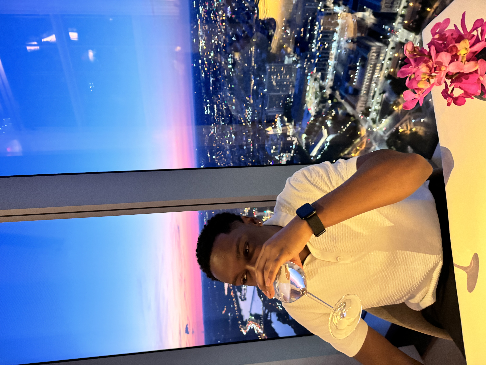
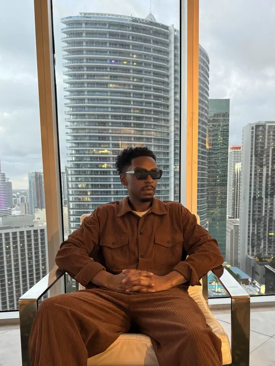

# Tobais Evans README

## Introduction

Tobais is a seasoned Marketing Director with over five years of experience with over five years of experience driving impactful campaigns and strategies across a range of industries. Originally from Delaware, he has led successful projects for dynamic business such as Opulent Equity, The Data Tribe, and Results Tutoring. With a proven track record of elevating brands and delivering results, Tobais is now channeling his passion into software engineering. His mission: to not only break into tech, but to help build a more diverse and inclusive future within the field.

## My Work hours:

When I was a full time marketing director,I started my mornings early with a gym session, then spent some time at home handling emails, reviewing campaigns, and finalizing content. I worked mostly online, typically from 9 to 6, but stayed flexible for client calls and time sensitive tasks outside those hours. During vacations, I made it a point to fully disconnect, often by heading somewhere remote.

Currently, I am enrolled full time in a 9 to 5 software engineering program called Code Differently as I transition into tech.

## My Work Routine

As a marketing director, my mornings typically began with a workout, coffee, and reviewing my task list. This routine helped me prepare mentally before diving into meetings. I found my most productive hours between 10 a.m. and 3 p.m., a prime window for creative thinking, campaign planning, and managing unexpected challenges efficiently.

## How I Structured My Day as a Marketing Director

My calendar balanced strategy sessions, content reviews, and collarborative brainstorms. I reserved dedicated time for fouced work, such as writing briefs or analyzing data, while allowing flexibility for urgent requests and quick check-ins.

## Areas Where I Can Add Value
Whether you need assistance naming a campaign, refining messaging, or clarifying complex marketing funnels, I bring clarity and strategic insight to creative projects. I enjoy helping teams streamline their ideas into actionable plans.

## Projects I've Led

My experience spans from brand refreshers for tutoring companies to developing pitch decks for startups. These projects varied in scope from multimillion-dollar budegets to resourceful initiatives driven by creativity and determination. Each oppurtunity contributed to my growth and expertise.

## My Creative and Strategic Approach

I operate at the intersection of creative intuition and data-driven decision-making. i generate innovative ideas while supporting them with solid analytics. I think big-picture but prioritize careful, deliberate execution.

## What I'm Doing Now (Code Differently)

Currently, I am immersed full-time in a software engineering program at Code Differently, learning languages such as HTML and Javascript. I approach coding with the same strategic mindset I applied to marketing, aiming to develop clean, efficient code.

## My Collaboration Style

I value clear communication, devices action, and well-definied next steps. I foster a positive working environment with mutual respect and transparency. You will always know where I stand, and I prioritize understanding what you need to succeed.

## Challenges I Work to Overcome

Unclear expectations, unproductive meetings, and vague feedback can slow progress. I ask clarifying questions to ensure allignment and deliver results that meet objectives.

## How I prefer to Give and Receive Feedback

I view feedback as essential and most effective when balanced-enough to enhance the work without overwhelming it. I prefer one-on-one conversations for substantial discussions and concise notes or comments for smaller adjustments.

## How I Recharge

When I disconnect, I fully unplug, often spending time in nature where technology is minimal. It's my way of recharging creatively and mentally, allowing me to return to work refreshed and focused.

## Contact Information

The best way to get in contact with my is...

Email: teevans252@gmail.com

Number: 3022748906

## Picture Of Me

