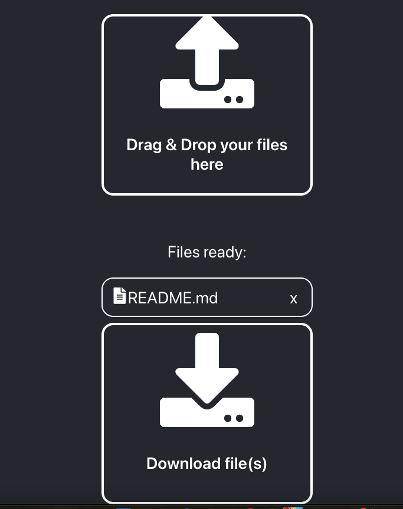

# Stretch Instructions

<br>

## Description
This is an app that takes files from the user using the dropbox and takes all the Markdown files (at least one) and return them as working HTML versions, downloading them onto the user's device once they click the download button.

## Prerequisites
- Node.js
- Python
- pip(Python package installer)

### 1. Clone repository
```
git clone https://github.com/yourusername/your-repo.git
cd your-repo
```

### 2. Install Node dependencies (Frontend)
```
npm install
```
### 3. Install Python dependencies (Backend)
```
pip install -r requirements.txt
```

### 4. Running the backend
```
python3 converter.py
```
### 5. Running the frontend
```
cd md_converter
npm start
```